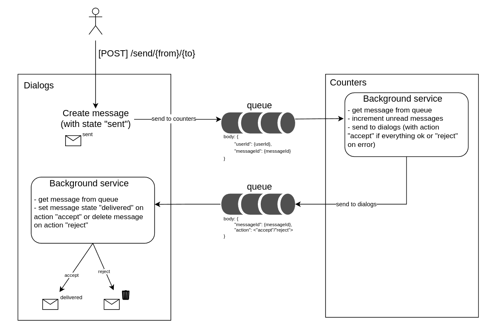

# Распределенные транзакции
# Микросервис счетчиков
Был разработан сервис счетчиков с двумя эндпоинтами:
* [GET] /unreadMessages/{user_id} - получить кол-во непрочитанных сообщений пользователя
* [POST] /markAsRead/{user_id} - пометить сообщение прочитанным
Для хранения счетчиков используется in-memory база данных (Redis). Хранение непрочитанных сообщений осуществляется по ключу с id пользователя.

## Архитектура

В основе распределенных транзакций лежит паттерн SAGA (хореография).

1. В сервисе диалогов в бд создается сообщение с промежуточным статусом "sent" (отправлено)
2. Сообщение отправляется в очередь брокера сообщений, которую слушает сервис счетчиков.
3. Сервис счетчиков достает сообщение из очереди, по ключу получателя инкрементирует значение.
4. В другую очередь брокера отправляется сообщение с действием "accept" если все прошло успешно или "reject" если произошла ошибка. Эту очередь слушает сервис диалогов.
5. Сервис диалогов достает сообщение из очереди и
* **"accept"** - меняет статус на "delivered" (доставлено)
* **"reject"** - удаляет сообщение 